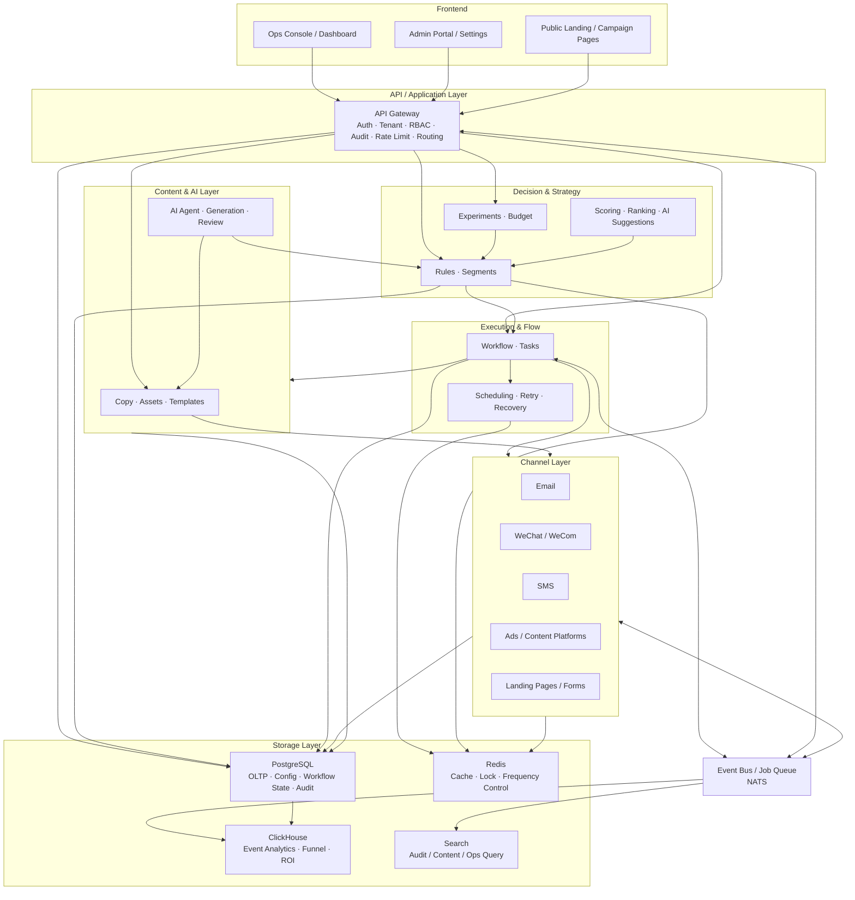
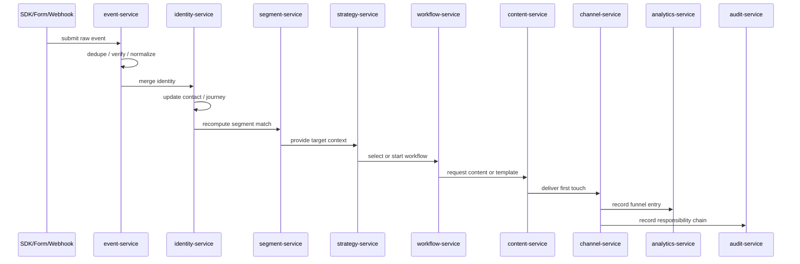
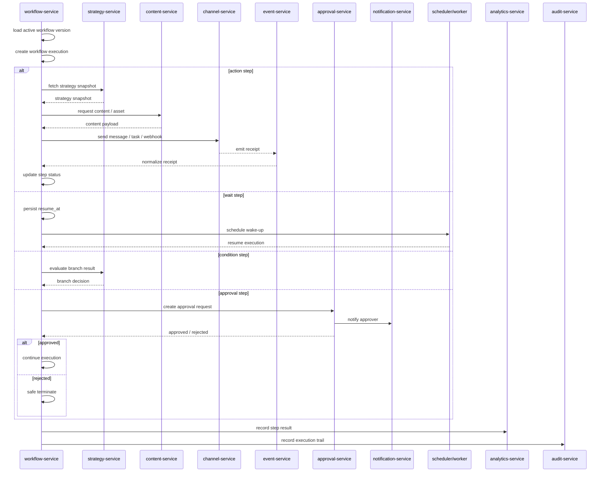
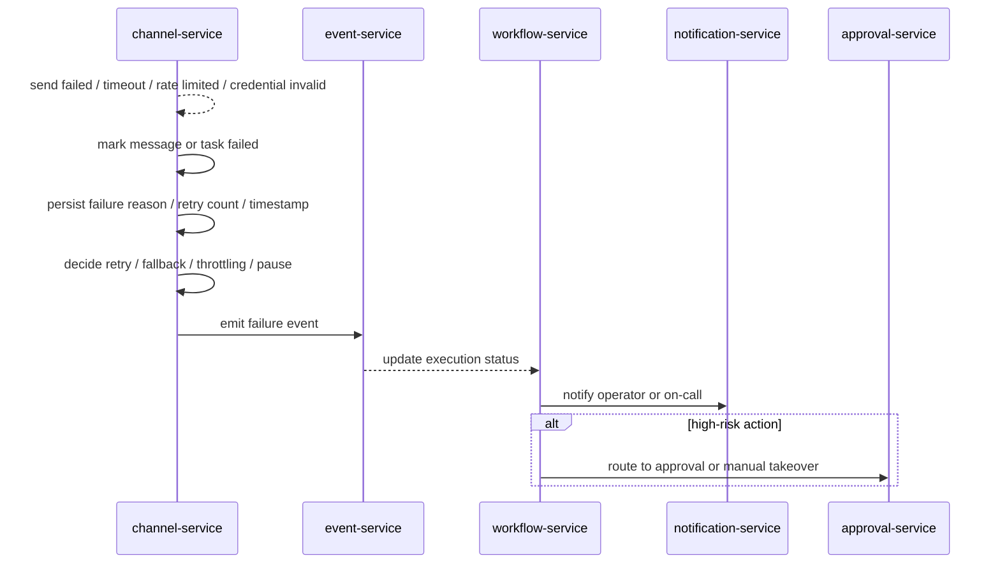

# Gravity 架构设计

## 1. 目标与边界

Gravity 的目标不是做一个“发消息的营销工具”，而是构建一个可以持续自动运行的运营系统。系统要把内容、投放、线索、跟进、转化、复购、留存和召回串成统一闭环，让运营工作从人工执行转为系统编排。

这份文档聚焦系统边界、模块职责和部署形态；工作流细节看 `docs/WORKFLOW.md`，渠道语义看 `docs/CHANNELS.md`，数据模型看 `docs/DATABASE.md`，对外接口看 `docs/API.md`。

### 1.1 设计目标

- 全渠道接入：统一承接广告、站点、表单、私域、内容平台、短信、邮件、企微、CRM 和支付回流
- 全链路闭环：覆盖获客、培育、转化、成交、复购、留存、召回和裂变
- 自动化决策：基于规则、策略、评分、实验和模型自动选择下一步动作
- 自动化执行：自动下发任务、自动触达、自动回写、自动重试、自动补偿
- 可控可审计：高风险动作保留审批与审计，低风险动作默认自动化
- 多交付模式：同一核心架构支持 SaaS 与私有化部署

### 1.2 能力边界

Gravity 负责“运营系统化和自动化”，不替代以下职责：

- 品牌战略最终拍板
- 产品方向最终拍板
- 大额预算最终审批
- 法律合规最终判断

系统可以提供建议、校验、预警和记录，但不会把这些职责完全自动化。

## 2. 术语约定

为避免跨文档混用，系统核心对象统一采用以下命名：

- `Contact`：联系人/线索统一实体
- `Identity`：跨渠道身份映射
- `Segment`：动态人群包
- `Journey`：生命周期旅程
- `Campaign`：活动
- `Workflow`：工作流
- `Action`：动作请求
- `Task`：待执行任务
- `Event`：事件
- `Conversion`：转化记录
- `Approval`：审批记录
- `AuditLog`：审计日志

## 3. 总体架构

Gravity 采用**模块化单体 + 事件驱动**的混合架构：核心业务在统一边界内实现，跨模块协作通过事件总线和工作流编排完成。这样既能保证一致性和可维护性，也能支撑后续扩展。



总架构的核心判断是：

- 前端只负责呈现和操作，不承载复杂业务规则
- API 层只做鉴权、校验、路由和编排入口，不直接承担执行逻辑
- 决策层先生成结论，编排层再推进状态，执行层再对外动作
- 事件总线负责异步解耦，数据库负责事实落地，分析库负责结果计算
- 任何跨模块协作都应能通过事件和状态重放恢复出来

### 3.1 总体链路

从系统流转角度看，一条完整链路通常是：

```text
前端 / Webhook / SDK
  -> API Gateway
  -> 决策层
  -> 工作流编排
  -> 渠道执行
  -> 事件回流
  -> 分析与审计
```

### 3.2 总体分工

- **前端**：配置、监控、审批、复盘
- **API 层**：统一入口、认证授权、输入校验、幂等控制
- **决策层**：规则、分群、评分、实验、策略建议
- **执行层**：工作流、调度、补偿、恢复
- **内容层**：素材生成、模板管理、内容审核
- **渠道层**：发送、回执、重试、降级
- **分析层**：漏斗、归因、ROI、实验分析
- **治理层**：审计、审批、频控、黑白名单、风控

## 4. 核心分层

### 4.1 接入层

接入层负责把外部世界的行为、回执和配置变化接进来，并标准化为统一事件。

- 渠道接入：广告、邮件、短信、企微、内容平台、落地页、表单、支付、客服
- 身份接入：匿名访客、线索、联系人、用户、企业、设备的统一映射
- 事件接入：页面浏览、点击、回复、提交、下单、成交、退订、投诉等
- 配置接入：渠道账号、模板、预算、审批策略、实验配置

### 4.2 数据层

数据层负责保存系统的主业务数据、流程状态、审计数据和分析数据。

- PostgreSQL：主业务数据、多租户配置、流程状态、审批、审计
- Redis：缓存、分布式锁、短期状态、频控、队列辅助
- ClickHouse：行为事件、漏斗分析、归因分析、ROI、时序聚合

### 4.3 画像与分群层

负责统一身份、标签、属性、生命周期状态和动态人群包。

- 身份合并：多渠道 ID 归并到统一 Contact/Identity
- 标签体系：显式标签、行为标签、推断标签、黑白名单
- 生命周期：新客、潜客、意向、成交、复购、流失、召回等状态
- 动态分群：基于规则、行为和属性实时生成目标人群

### 4.4 决策层

负责决定“对谁做什么、什么时候做、通过什么渠道做、是否需要审批”。

- 规则引擎：频控、黑白名单、资格判断、合规兜底
- 策略引擎：动作优先级、触达顺序、预算分配、路径选择
- 评分引擎：线索质量、成交概率、流失风险、复购概率、内容匹配度
- 实验引擎：A/B 测试、多版本策略、对照组管理、结果比较
- AI 策略层：生成选题、文案、话术、实验建议和下一步动作

### 4.5 编排层

负责把策略转成可执行流程，并保证可靠性、可恢复性和幂等性。

- 工作流编排：触发、分支、等待、升级、补偿、重试
- 任务调度：定时任务、延迟任务、队列任务、失败重放
- 事务边界：动作执行和状态回写必须可追踪、可回放
- 人工介入：审批、暂停、接管、人工修正

### 4.6 执行层

负责真正把动作送出去，并把结果送回来。

- 内容执行：文章、海报文案、落地页、邮件链路、私域话术、短信模板
- 触达执行：发送、分发、催付、召回、复购提醒、跟进提醒
- 销售辅助：线索评分、优先级队列、跟进建议、自动摘要
- 状态回写：发送结果、回执、用户反馈、转化数据、异常情况

### 4.7 分析与学习层

负责把结果变成经验，再把经验变成下一轮策略。

- 漏斗分析：曝光、点击、回复、加微、留资、预约、成交、复购
- 归因分析：首触点、末触点、线性、规则型、时间衰减归因
- 实验学习：成功策略沉淀、失败策略降权、自动推荐优化动作
- 运营看板：渠道健康、内容胜率、自动化覆盖率、人工介入率

### 4.8 治理层

负责控制系统在自动化运行过程中的风险。

- 审批治理：大额投放、敏感话术、批量触达、关键配置变更
- 安全控制：凭证加密、权限隔离、审计日志、操作追踪
- 频控与投诉保护：触达频率、黑名单、退订、投诉、封禁策略
- 降级策略：渠道失败、数据缺失、模型不可用时自动回退到规则模式

## 5. 核心业务闭环

### 5.1 内容到留资

系统根据人群和目标自动生成内容、投放或发布、承接到落地页/表单，再把线索回流到统一画像中。

### 5.2 线索到成交

系统对线索打分、分配、排序、跟进和催单，并把销售过程中的反馈回写到旅程中。

### 5.3 成交到复购

系统识别购买后的生命周期阶段，自动触发二次触达、会员运营、关联推荐和复购提醒。

### 5.4 复购到留存

系统持续监测活跃度、流失风险和偏好变化，自动进行保活、召回和升级运营。

## 6. 关键对象模型

- **Organization**：租户和组织边界
- **User**：系统操作者和权限主体
- **Identity**：跨渠道身份映射
- **Contact**：联系人/线索统一实体
- **Segment**：分群与动态人群包
- **Journey**：生命周期旅程
- **Campaign**：活动
- **Workflow**：工作流
- **Action**：动作请求
- **Task**：待执行任务
- **ContentAsset**：文案、图片、脚本、模板
- **ChannelAccount**：渠道账号和授权信息
- **Event**：事件
- **Conversion**：转化记录
- **Experiment**：实验配置和结果
- **Approval**：审批记录
- **AuditLog**：审计日志

## 7. 事件流与闭环

Gravity 的核心不是单次触达，而是持续闭环。

```text
用户行为 / 外部回调 / 系统事件
        │
        ▼
  Event Ingestion
        │
        ├──► 画像更新
        ├──► 策略重算
        ├──► 工作流触发
        ├──► 分析入库
        └──► 实验归档
        │
        ▼
  下一轮自动动作生成
```

系统必须保证每一轮动作都能产生可观察结果，并把结果反向喂给策略层和内容层，从而不断提升命中率、转化率和效率。

## 8. 工作流模型

工作流是 Gravity 的执行骨架，所有运营动作都应抽象成可编排的流程节点。

### 8.1 节点类型

- 触发器：事件触发、定时触发、条件触发、手动触发
- 执行动作：发送消息、写入标签、更新属性、创建任务、调用 webhook
- 控制节点：条件分支、等待、并行、合并、重试、补偿
- 智能节点：内容生成、策略推荐、意图识别、风险判断
- 治理节点：审批、降级、审计、告警

### 8.2 工作流要求

- 支持幂等执行
- 支持断点恢复
- 支持失败补偿
- 支持按人群和事件动态触发
- 支持人工审批插入到关键节点

## 9. 渠道集成原则

所有渠道统一通过 `ChannelAdapter` 抽象接入，保证触达执行、状态回传和指标采集的一致性。

- 邮件：模板化发送、打开/点击回传、退订处理
- 微信/企微：消息触达、标签同步、会话回传
- 短信：高优先级通知、验证和催付
- 内容平台：内容发布、互动回收、引流归因
- 广告平台：投放同步、消耗回传、转化对账
- 落地页/表单：转化承接、表单提交、事件埋点

## 10. 权限与多租户

- 默认使用 PostgreSQL RLS 做租户隔离
- 使用 RBAC 控制组织、团队、角色和动作权限
- 高风险接口需要审批和审计
- 所有外部渠道凭证必须加密存储并支持轮换

## 11. 部署形态

### 11.1 SaaS

- 适合标准化交付和快速开通
- 支持租户隔离、计费、套餐和配额控制
- 适合统一升级和集中运维

### 11.2 私有化

- 适合数据敏感、合规要求高或深度定制的企业
- 可部署在客户自有云、专有云或内网环境
- 支持独立数据库、独立队列和独立网关

## 12. 模块映射

| crate | 职责 |
|------|------|
| `gravity-api` | API 网关、认证、租户、权限、编排入口 |
| `gravity-core` | 领域模型、业务规则、状态定义 |
| `gravity-db` | 数据访问、迁移、仓储实现 |
| `gravity-channels` | 渠道适配、凭证管理、触达执行 |
| `gravity-workflow` | 流程引擎、调度、恢复、补偿 |
| `gravity-analytics` | 事件分析、漏斗、归因、报表 |
| `gravity-common` | 共享工具、通用类型、基础设施 |


## 13. 运行时数据流

### 13.1 写入路径

一次典型的运营动作，通常按以下路径流转：

```text
外部请求 / 外部事件
  -> 鉴权与租户解析
  -> 请求校验与幂等检查
  -> 决策层计算
  -> 工作流实例创建或推进
  -> 渠道适配器执行
  -> 回执写回与状态更新
  -> 分析事件入库
  -> 审计日志落库
```

写入路径的关键要求：

- 同一动作在业务层必须具备幂等键
- 任何执行结果都必须落入执行状态表或事件表
- 同步接口只负责启动动作，长耗时过程必须异步化
- 失败时要能回退到安全状态，而不是半执行状态

### 13.2 读取路径

系统读数据时通常分三层：

- **事务读**：联系人、工作流、审批、渠道配置等实时数据，从 PostgreSQL 读取
- **缓存读**：会话态、频控、短期计算结果、权限上下文，从 Redis 读取
- **分析读**：漏斗、归因、内容表现、渠道 ROI、实验结果，从 ClickHouse 或搜索索引读取

读取路径的原则是：

- 管理面优先读事务库，保证准确性
- 报表面优先读分析库，保证吞吐和聚合效率
- 画像和分群查询要尽量支持预计算与增量刷新

### 13.3 同步与异步边界

以下动作适合同步返回：

- 登录、配置查询、列表查询、审批发起、工作流启动确认

以下动作必须异步处理：

- 批量触达、渠道发送、素材生成、实验计算、归因聚合、回流同步

这样可以避免 API 被长任务拖慢，同时让执行链路具备重试和补偿能力。

## 14. 模块职责拆解

### 14.1 API 与应用层

API 层负责对外暴露统一业务入口，不直接承载业务规则。

职责包括：

- 认证、租户上下文、RBAC、请求限流
- 输入校验、幂等键校验、权限校验
- 请求路由到对应领域服务
- 将高风险写入转换为审批请求
- 将同步请求拆成可执行的领域命令或工作流启动事件

### 14.2 决策与策略层

决策层负责“对谁做什么、什么时候做、通过什么渠道做”。

职责包括：

- 人群资格判断和黑白名单过滤
- 评分、排序、优先级和预算分配
- 实验分流和策略对照
- AI 建议的接入与约束
- 为工作流生成动作请求或策略快照

### 14.3 工作流与编排层

编排层负责把策略变成可恢复的执行过程。

职责包括：

- 工作流定义编译和版本管理
- 节点推进、分支、等待、重试、补偿
- 任务调度和延迟恢复
- 执行状态机维护
- 执行中的人工审批挂接

### 14.4 渠道与执行层

执行层负责把动作真正送到外部渠道。

职责包括：

- 统一出站消息模型
- 渠道凭证装载、鉴权和轮换
- 发送、查询、回执拉取和 webhook 处理
- 限流、重试、降级和备用渠道切换
- 发送结果与失败原因标准化回写

### 14.5 内容与 AI 层

内容层负责生成和管理可执行素材。

职责包括：

- 文案、邮件、短信、私域话术、落地页内容生成
- 模板变量填充与多版本生成
- 敏感词和品牌规范校验
- 审批流前置到内容生成结果
- 为实验引擎提供素材变体

### 14.6 分析与学习层

分析层负责把执行结果变成下一轮策略输入。

职责包括：

- 事件入库和聚合
- 漏斗、归因、ROI 和实验分析
- 渠道健康和自动化覆盖率看板
- 策略效果回训与建议输出

### 14.7 治理层

治理层负责约束系统的自动化边界。

职责包括：

- 审批与授权
- 审计与追踪
- 合规、退订、投诉和黑名单处理
- 配额、预算和频控
- 降级、熔断和人工接管

## 15. 事件与状态约束

### 15.1 事件命名

领域事件建议统一采用 `domain.action` 风格，例如：

- `contact.created`
- `workflow.started`
- `workflow.step_executed`
- `message.sent`
- `message.delivered`
- `message.failed`
- `conversion.recorded`

### 15.2 状态更新

所有核心状态都应满足以下规则：

- 状态变更必须可追踪来源
- 状态写入必须幂等
- 历史执行不能被新版本工作流直接篡改
- 关键状态变化要同步产生审计事件

### 15.3 Outbox / Inbox 思路

为了避免“数据库写入成功、事件发出失败”或“事件已处理、状态未落库”的不一致，建议采用：

- **Outbox**：业务事务内先写事件待发送记录，再异步发布到消息总线
- **Inbox**：外部回调和内部消费先做去重记录，再进入后续处理

这能显著降低渠道回执、工作流推进和事件联动中的重复执行风险。

## 16. 部署与伸缩

### 16.1 SaaS 部署

SaaS 模式下，建议按“共享计算、隔离数据、分层扩展”设计：

- 计算层共享部署，按租户配额限流
- 主库按租户隔离策略和访问控制实现逻辑隔离
- 分析库按租户或租户组进行分区
- 高峰任务通过队列和异步 worker 扩容

### 16.2 私有化部署

私有化模式下，建议按“独立环境、独立凭证、独立集成”设计：

- 业务库、消息队列和对象存储可独立部署
- 渠道凭证和外部连接策略由客户环境掌控
- 与外部系统的网络边界通过网关和代理收敛
- 升级、回滚和审计都以单客户环境为单位执行

### 16.3 伸缩热点

系统最容易成为热点的部分通常包括：

- 事件写入和回执回流
- 大规模分群刷新
- 批量消息发送
- 实验聚合和漏斗统计
- 工作流恢复和延迟任务扫描

这些部分需要按队列、分片、批处理和增量计算设计。

## 17. 可观测性与恢复

### 17.1 可观测性

系统应同时具备三类可观测性：

- **日志**：请求日志、执行日志、回执日志、审计日志
- **指标**：发送成功率、回执延迟、任务堆积、失败率、审批时长
- **链路追踪**：从 API 请求到工作流、渠道、回写、分析的链路串联

### 17.2 失败恢复

典型恢复机制包括：

- 任务重试和指数退避
- 死信队列和人工重放
- 失败告警和自动降级
- 状态快照和执行回放
- 低风险动作自动重试，高风险动作转人工确认

### 17.3 运行治理

建议额外引入运行治理看板，重点看：

- 自动化覆盖率
- 人工介入率
- 渠道健康度
- 审批积压
- 回执延迟
- 工作流平均恢复时长

## 18. 组件级架构

这一层把前面的“能力分层”进一步拆成可以落到代码和部署单元上的组件。目标不是把系统拆碎，而是把职责、依赖和数据边界说清楚，方便后续实现、扩展和排障。

### 18.1 前端组件

```text
Ops Console
  ├─ Dashboard
  ├─ Contact / Segment Manager
  ├─ Campaign Studio
  ├─ Workflow Builder
  ├─ Approval Center
  ├─ Audit Viewer
  └─ Analytics Explorer

Admin Portal
  ├─ Tenant Settings
  ├─ Role & Permission
  ├─ Channel Accounts
  ├─ Template Library
  ├─ Budget / Quota
  └─ System Health

Public Landing
  ├─ Campaign Pages
  ├─ Forms
  ├─ Conversion Tracking
  └─ Consent / Unsubscribe
```

前端组件的边界：

- `Ops Console` 面向运营与增长团队，核心是创建、配置、监控和复盘
- `Admin Portal` 面向管理员和实施团队，核心是租户、权限、渠道和系统治理
- `Public Landing` 面向外部用户，核心是承接流量、留资和转化

### 18.2 后端核心组件

| 组件 | 职责 | 主要依赖 | 主要存储 |
|------|------|----------|----------|
| `api-gateway` | 统一鉴权、路由、限流、幂等、请求编排入口 | Auth、Tenant、RBAC、Audit | PostgreSQL / Redis |
| `identity-service` | 身份归并、联系人映射、匿名 ID 关联 | Event Ingestion、Profile Store | PostgreSQL / Redis |
| `segment-service` | 静态/动态分群、条件求值、预览计算 | Identity、Event、Rule Engine | PostgreSQL / ClickHouse |
| `strategy-service` | 规则、评分、实验、预算、路径选择 | Segment、Experiment、Policy | PostgreSQL / Redis |
| `content-service` | 内容资产、模板、生成、审核、版本管理 | AI Layer、Approval、Channel Profile | PostgreSQL / Object Storage |
| `workflow-service` | 工作流定义、执行、恢复、补偿、版本控制 | Strategy、Channel、Approval | PostgreSQL / Redis |
| `channel-service` | 渠道连接、适配器、发送、回执、轮换 | Credentials、Outbound Queue | PostgreSQL / Redis |
| `event-service` | 事件接入、标准化、去重、回流、Outbox/Inbox | Webhook、SDK、Channel 回执 | PostgreSQL / ClickHouse |
| `approval-service` | 审批发起、流转、放行、拒绝、升级 | Workflow、Policy、Audit | PostgreSQL |
| `analytics-service` | 漏斗、归因、ROI、实验结果、看板数据 | Event、Conversion、Campaign | ClickHouse |
| `audit-service` | 审计记录、追踪、检索、合规导出 | 全部写入组件 | PostgreSQL |
| `notification-service` | 系统通知、告警、人工介入提醒 | Workflow、Approval、Health Check | PostgreSQL / Channel |

### 18.3 基础设施组件

- `PostgreSQL`：保存主业务数据、执行状态、配置、审批和审计
- `Redis`：保存幂等键、锁、队列辅助、短期状态和频控
- `NATS`：承载事件总线、任务队列和异步编排消息
- `ClickHouse`：承载行为明细、漏斗聚合、归因分析和报表查询
- `Object Storage`：保存素材、模板、导入文件和导出文件
- `Search`：支撑审计检索、活动检索、内容检索和运维查询
- `Scheduler / Worker`：执行延迟任务、恢复任务、批处理任务和重试任务
- `Secret Store`：保存渠道凭证、签名密钥和加密材料

### 18.4 核心交互链路

#### 新线索进入

```text
SDK / Form / Webhook
  -> event-service
  -> identity-service
  -> segment-service
  -> strategy-service
  -> workflow-service
  -> channel-service
  -> analytics-service / audit-service
```

#### 工作流执行

```text
workflow-service
  -> strategy-service 读取策略快照
  -> content-service 生成或选取内容
  -> channel-service 执行发送
  -> event-service 接收回执
  -> workflow-service 推进节点
  -> analytics-service 记录结果
  -> audit-service 记录责任链
```

#### 高风险动作审批

```text
strategy-service / workflow-service
  -> approval-service 创建审批单
  -> notification-service 通知审批人
  -> approval-service 放行或拒绝
  -> workflow-service 继续执行或安全终止
  -> audit-service 记录决策
```

#### 渠道失败降级

```text
channel-service 发送失败
  -> 重试 / 备用渠道切换
  -> event-service 记录失败原因
  -> workflow-service 更新执行状态
  -> notification-service 告警
  -> 如需人工介入则进入 approval / ticket 流程
```

### 18.5 组件间依赖原则

- 前端只依赖 API 层，不直连后端内部服务
- API 层只做路由、鉴权、校验和编排，不写复杂业务规则
- 策略层负责决策，工作流层负责执行，渠道层负责外发
- 事件层负责传播事实，分析层负责计算结果，审计层负责记录责任
- 高风险动作必须经过审批层，不能直接穿透到执行层

### 18.6 组件拆分的落地顺序

如果后续要逐步实现，建议按以下顺序拆：

1. `api-gateway`、`audit-service`、`tenant/RBAC`
2. `event-service`、`identity-service`、基础画像
3. `workflow-service`、`channel-service`、基础发送与回执
4. `segment-service`、`strategy-service`、基础决策
5. `content-service`、`approval-service`、基础生成与放行
6. `analytics-service`、`notification-service`、运营看板与告警

这个顺序的核心原则是：先打通事实流，再打通执行流，最后补齐优化流。

## 19. 关键时序图

### 19.1 新线索进入



关键点：

- 原始事件先落事件层，再进入业务层，避免外部输入直接污染核心状态
- 身份合并和分群重算必须在策略决策前完成
- 第一次触达应尽量由工作流驱动，而不是散落在控制层

### 19.2 工作流执行



关键点：

- 工作流实例必须锁定启动时版本，避免在线变更影响历史执行
- `wait` 只改变状态，不阻塞线程
- `approval` 节点是治理插槽，不是旁路流程
- 每一步都应能回放、重试和审计

### 19.3 渠道失败降级



降级原则：

- 低风险动作优先自动重试或切换渠道
- 高风险动作不要盲目多次重发，避免放大风险
- 渠道不可用时，应优先保护用户体验和合规边界
- 失败原因必须进入分析层，作为渠道健康和策略优化输入
