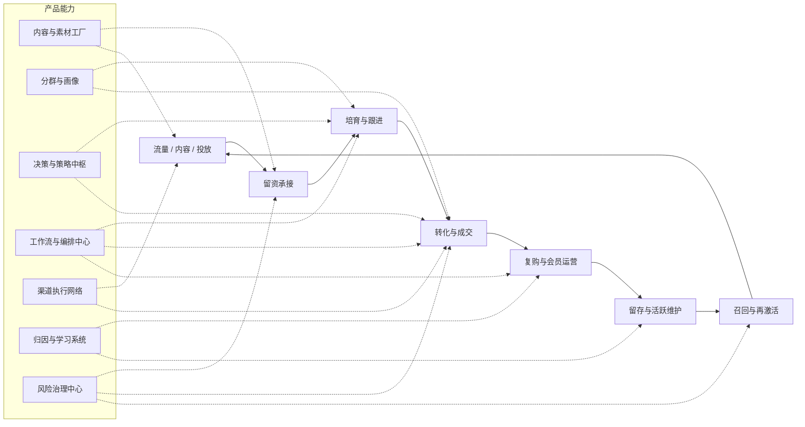
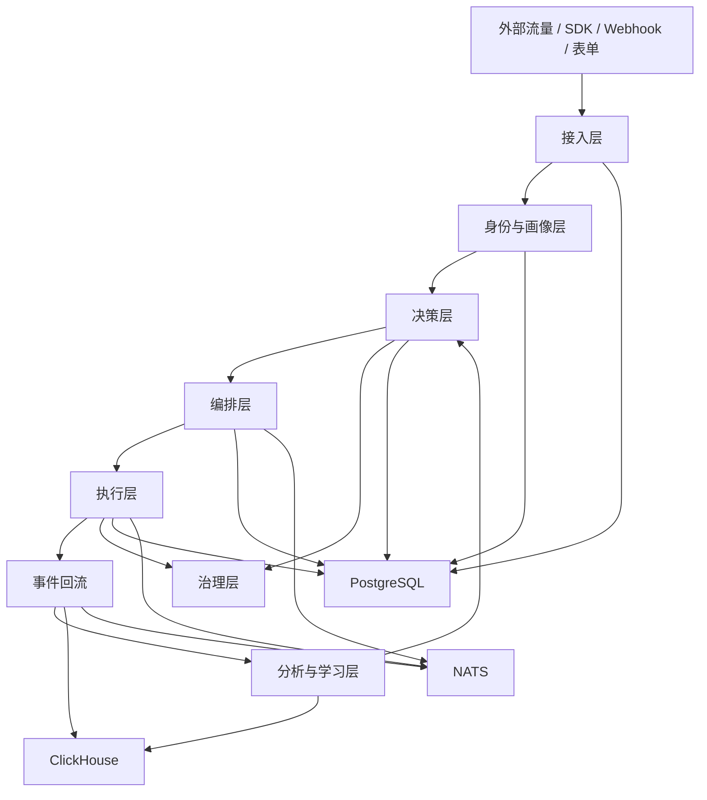

# Gravity 产品与架构蓝图

## 1. 蓝图摘要

Gravity 的目标不是做一个“发消息的营销工具”，而是构建一个可以持续自动运行的运营系统。它要把内容、投放、线索、跟进、转化、复购、留存和召回串成统一闭环，让运营工作从人工执行转为系统编排。

如果把传统运营系统理解为“工具集合”，Gravity 则是“增长操作系统”：

- 接入用户行为、线索、渠道回执、订单和客服反馈
- 基于规则、策略、模型和实验结果自动判断下一步动作
- 通过工作流和渠道适配器执行动作，并把结果回写
- 持续学习哪些内容、渠道、节奏和人群组合更有效

## 2. 解决的问题

- 运营动作分散在多个工具里，导致流程断裂、数据割裂、责任不清
- 内容、投放、线索、跟进、成交、复购之间缺少统一闭环
- 大量重复动作依赖人工执行，成本高、错误率高、难以复制
- 单点自动化无法形成持续优化的增长系统

## 3. 核心判断

Gravity 应该被设计成三层统一：

1. **统一数据层**：所有用户、渠道、行为、转化、回执进入同一数据基座
2. **统一决策层**：所有人群、规则、评分、实验、AI 建议进入同一策略中枢
3. **统一执行层**：所有触达、审批、回写、补偿进入同一编排与治理体系

如果系统最终只做到以下任意一项，它都不算完整：

- 只会发消息
- 只会做工作流
- 只会做 CRM
- 只会做内容生成
- 只会做数据看板

Gravity 只有在“决策、执行、回流、学习、治理”都具备后，才算真正成型。

## 4. 术语约定

为了避免跨文档混用，这里约定核心对象统一采用“英文主名 + 中文解释”的写法：

- `Contact`：联系人/线索统一实体
- `Identity`：跨渠道身份映射
- `Segment`：动态人群包
- `Journey`：生命周期旅程
- `Campaign`：活动
- `Workflow`：工作流
- `Action`：动作请求
- `Task`：待执行任务
- `Event`：事件
- `Conversion`：转化记录
- `Approval`：审批记录
- `AuditLog`：审计日志

## 5. 产品愿景

Gravity 的最终形态，是让运营团队从重复劳动中解放出来，把精力放回到目标、策略、创意和异常处理上。

### 5.1 业务愿景

- 让获客、培育、转化、复购、留存、召回和裂变形成统一链路
- 让内容生产、渠道触达、线索流转、销售协同、用户回流形成统一闭环
- 让运营动作尽量自动化，人工仅在策略设定、关键审批和异常处置时介入
- 让每一次动作都能被衡量、被归因、被复盘、被优化

### 5.2 产品定位

Gravity 不是以下几种工具的简单拼接：

- 不是单点营销自动化工具
- 不是纯 CRM
- 不是仅负责发消息的渠道集成平台
- 不是只做工作流编排的低代码工具
- 不是只给运营人员写文案的 AI 工具

Gravity 需要同时具备这些能力，但它们都必须被统一到同一套数据、同一套权限、同一套审计、同一套目标体系中。

## 6. 目标用户与使用场景

### 6.1 目标用户

- **增长负责人**：关注投放效率、线索质量、转化率和 ROI
- **运营负责人**：关注活动编排、内容生产、触达效率和自动化覆盖率
- **销售负责人**：关注线索分配、跟进效率、成交率和漏斗健康度
- **客户成功/留存负责人**：关注复购、活跃、唤醒和流失预警
- **管理者**：关注整体增长、资源投入和风险控制
- **实施/架构团队**：关注集成能力、数据隔离、扩展性和可交付性

### 6.2 典型场景

- 新用户进入后自动进入欢迎与培育链路
- 广告或内容引流后自动完成留资、分配和跟进
- 高意向线索自动升级处理并触发销售动作
- 成交后自动进入复购和会员运营链路
- 沉默用户自动进入召回和再激活链路
- 活动过程中自动 A/B 测试内容和触达节奏
- 某个渠道异常时自动降级、切换或暂停

## 7. 设计原则

### 7.1 闭环优先

任何能力都必须能从输入开始，到执行结束，再把结果回流到下一轮决策。

### 7.2 自动优先

重复度高、规则明确、风险可控的工作优先自动化。

### 7.3 可配置优先

不同业务线、行业和团队差异，通过配置、模板和策略解决，避免硬编码分叉。

### 7.4 可审计优先

系统的每次关键动作都必须能追踪到责任人、来源策略、执行时间和结果。

### 7.5 风险可控

高风险动作保留审批门和治理门，必要时可暂停、回滚、冻结或降级。

### 7.6 多租户优先

同一套产品必须同时支持 SaaS 标准化交付和私有化部署。

## 8. 端到端运营闭环

```text
外部流量 / 用户行为 / 渠道回执 / 业务回流
                │
                ▼
         统一接入与标准化
                │
                ▼
          身份合并与画像更新
                │
                ▼
          分群、评分与策略判断
                │
                ▼
          内容生成与工作流编排
                │
                ▼
          渠道触达与任务执行
                │
                ▼
         行为回传、转化回流、异常告警
                │
                ▼
         归因分析、实验分析、策略回训
                │
                └───────────────► 下一轮动作
```

闭环必须持续回答这六个问题：

1. 现在是谁？
2. 处于什么阶段？
3. 应该对他做什么？
4. 通过什么渠道做？
5. 结果如何？
6. 下一步该怎么优化？

## 9. 产品能力地图

### 9.1 统一数据中心

统一接入所有业务信号，形成可计算的用户与业务基础设施。

- 身份统一：匿名访客、联系人、线索、客户、企业、设备映射
- 行为统一：浏览、点击、留资、加微、咨询、下单、复购、投诉
- 业务统一：活动、内容、渠道、订单、工单、审批、实验
- 分析统一：漏斗、归因、ROI、留存、转化、复购

### 9.2 智能分群与画像

通过规则和模型对人群进行动态切分。

- 标签体系：显式标签、行为标签、推断标签、黑白名单
- 生命周期：新客、潜客、意向、成交、复购、流失、召回
- 目标人群：按产品、渠道、阶段、地域、行为、价值进行组合

### 9.3 决策与策略中枢

系统决定“对谁、在什么时候、通过什么内容、经由哪个渠道、以什么节奏”进行动作。

- 规则引擎：资格判断、频控、合规、预算、黑白名单
- 策略引擎：动作优先级、触达顺序、预算分配、路径选择
- 评分引擎：线索质量、转化概率、流失风险、复购概率
- 实验引擎：A/B 测试、多版本策略、对照组和显著性判断

### 9.4 内容与素材工厂

系统根据业务目标、用户阶段和渠道要求自动产出内容。

- 标题、正文、摘要、海报文案、落地页内容
- 私信、邮件、短信、社群、企微话术
- 多版本素材与实验变体
- 品牌规范校验、敏感词过滤、渠道格式适配

### 9.5 工作流与编排中心

把策略转成具体动作，并在执行过程中管理等待、分支、补偿和重试。

- 事件触发
- 条件分支
- 延迟等待
- 并行执行
- 人工审批
- 失败补偿
- 结果回写

### 9.6 渠道执行网络

统一管理真实世界中的触达与回执。

- 邮件、短信、微信、企微、内容平台、广告平台、落地页、表单、客服
- 所有渠道统一通过适配器接入
- 统一接收发送结果、打开、点击、回复、退订、投诉、转化事件

### 9.7 归因与学习系统

系统必须知道“为什么有效”，而不仅仅是“有没有效果”。

- 漏斗分析：每个阶段的转化损耗
- 归因分析：不同触点对结果的贡献
- 实验分析：不同策略的增益对比
- 策略回训：把高胜率组合沉淀为默认策略

### 9.8 风险治理中心

自动化越强，治理越重要。

- 审批流
- 审计日志
- 配额与预算控制
- 频控与投诉保护
- 渠道降级与回滚
- 多租户隔离与权限控制

## 10. 架构蓝图

### 10.1 分层结构

Gravity 采用“模块化单体 + 事件驱动”的架构方式。

- **接入层**：接收外部请求、Webhook、回调和批量导入
- **数据层**：保存业务数据、状态数据和分析数据
- **画像层**：统一身份、标签、属性和生命周期
- **决策层**：规则、评分、策略、实验、AI 建议
- **编排层**：工作流、调度、补偿、恢复
- **执行层**：渠道发送、任务执行、状态回写
- **分析层**：漏斗、归因、ROI、实验、看板
- **治理层**：权限、审计、审批、风控、降级

### 10.2 推荐系统图

```text
┌──────────────────────────────────────────────────────────────┐
│                         Gravity Platform                     │
│                                                              │
│  ┌──────────────┐   ┌──────────────┐   ┌───────────────────┐ │
│  │ Ops Console  │   │ Admin Portal │   │ Public Landing    │ │
│  │ / Dashboard  │   │ / Settings   │   │ / Campaign Pages  │ │
│  └──────┬───────┘   └──────┬───────┘   └─────────┬─────────┘ │
│         │                  │                     │           │
│         └──────────────────┼─────────────────────┘           │
│                            REST / WebSocket                   │
│  ┌─────────────────────────▼──────────────────────────────┐   │
│  │                 API / Application Layer                │   │
│  │ Auth · Tenant · RBAC · Audit · Routing · Validation    │   │
│  └──────────────┬──────────────────────┬──────────────────┘   │
│                 │                      │                      │
│  ┌──────────────▼───────┐  ┌───────────▼──────────┐           │
│  │  Decision & Strategy  │  │  Execution & Flow    │           │
│  │ Rules · Segments      │  │ Workflow · Tasks     │           │
│  │ Experiments · Budget   │  │ Scheduling · Retry   │           │
│  └──────────────┬────────┘  └───────────┬──────────┘           │
│                 │                        │                      │
│  ┌──────────────▼─────────┐  ┌───────────▼──────────┐           │
│  │ Content & AI Layer      │  │ Channel Layer        │           │
│  │ Copy · Assets · Agent   │  │ Email · WeChat ...   │           │
│  └──────────────┬─────────┘  └───────────┬──────────┘           │
│                 │                        │                      │
│  ┌──────────────▼────────────────────────▼──────────────────┐   │
│  │                Event Bus / Job Queue (NATS)              │   │
│  └──────────────┬────────────────────────┬──────────────────┘   │
│                 │                        │                      │
│  ┌──────────────▼───────┐  ┌─────────────▼──────────┐          │
│  │ PostgreSQL / Redis    │  │ ClickHouse / Search    │          │
│  │ OLTP · Cache · Lock   │  │ OLAP · Funnel · ROI    │          │
│  └───────────────────────┘  └────────────────────────┘          │
└──────────────────────────────────────────────────────────────┘
```

### 10.3 关键设计选择

- 事务与分析分离：OLTP 使用 PostgreSQL，分析使用 ClickHouse
- 状态与事件分离：流程状态与行为事件不混表
- 定义与执行分离：工作流定义与执行实例分离，便于版本化
- 决策与执行分离：策略先生成动作请求，再由执行层落地
- 渠道与业务分离：渠道通过适配器接入，不侵入领域逻辑

### 10.4 推荐技术承载

- 前端：React + TypeScript + Vite
- 后端：Rust + Axum
- 事务存储：PostgreSQL
- 分析存储：ClickHouse
- 缓存与短期状态：Redis
- 消息与编排：NATS
- 部署：Docker Compose / Kubernetes

### 10.5 产品视角总图

从产品视角看，Gravity 的价值链是“获客 -> 留资 -> 培育 -> 转化 -> 复购 -> 留存 -> 召回”，每一段都对应一组可配置能力。



### 10.6 架构视角总图

从架构视角看，产品能力对应到一条稳定的数据与执行链路：



这个视角强调的是：

- 产品层描述“用户感知到什么能力”
- 架构层描述“这些能力由哪些层完成”
- 中间通过统一事件、统一对象和统一编排把两者连接起来

### 10.7 产品到架构映射表

| 产品能力 | 主要架构层 | 关键组件 |
|------|------|------|
| 内容与素材工厂 | 内容层 + 治理层 | `content-service`、`approval-service` |
| 智能分群与画像 | 画像层 + 数据层 | `identity-service`、`segment-service` |
| 决策与策略中枢 | 决策层 | `strategy-service` |
| 工作流与编排中心 | 编排层 + 执行层 | `workflow-service`、`scheduler/worker` |
| 渠道执行网络 | 执行层 + 渠道层 | `channel-service` |
| 归因与学习系统 | 分析层 | `analytics-service` |
| 风险治理中心 | 治理层 | `approval-service`、`audit-service`、`notification-service` |

### 10.8 架构说明

- 先从产品链路理解系统，再从架构层理解实现，最后再回到对象模型和流程
- 任一产品能力都不应直接依赖底层存储，而应经过对应架构层处理
- 任一架构层都应该能解释它支撑了哪些产品能力和业务阶段

## 11. 关键对象模型

以下对象构成系统的业务骨架：

- **Organization**：租户和组织边界
- **User**：系统操作者和权限主体
- **Identity**：跨渠道身份映射
- **Contact**：联系人/线索统一实体
- **Segment**：动态人群包
- **Journey**：生命周期旅程
- **Campaign**：活动
- **Workflow**：工作流
- **Action**：动作请求
- **Task**：待执行任务
- **ContentAsset**：内容、模板和素材
- **ChannelAccount**：渠道账号和授权信息
- **Event**：事件
- **Conversion**：转化记录
- **Experiment**：实验配置和结果
- **Approval**：审批记录
- **AuditLog**：审计日志

## 12. 关键业务流程

### 11.1 内容到留资

1. 系统选择目标人群
2. 系统生成或选取内容版本
3. 系统发布到渠道或落地页
4. 用户留资后进入统一画像
5. 系统自动打标签、分群、分配或进入后续流程

### 11.2 线索到成交

1. 系统对线索进行评分和排序
2. 系统按规则分配给销售或自动培育
3. 系统跟踪跟进、回复和转化动作
4. 系统自动触发催单、提醒或升级处理
5. 成交结果回流到策略与分析系统

### 11.3 成交到复购

1. 系统识别购买后阶段
2. 系统启动会员、交叉销售或续费流程
3. 系统自动识别复购机会和流失风险
4. 系统触发个性化召回或升级触达

### 11.4 召回与留存

1. 系统检测沉默或流失风险
2. 系统选择召回策略与渠道
3. 系统执行低风险自动触达
4. 系统在高风险动作上走审批和风控

## 13. 文档关系

- `README.md`：项目总入口和快速理解
- `docs/BLUEPRINT.md`：产品愿景、能力地图和最终态判断
- `docs/WORKFLOW.md`：工作流状态机、编排和恢复
- `docs/CHANNELS.md`：渠道抽象、回执和失败处理
- `docs/DATABASE.md`：数据模型、隔离和分析存储
- `docs/API.md`：对外接口和业务语义
